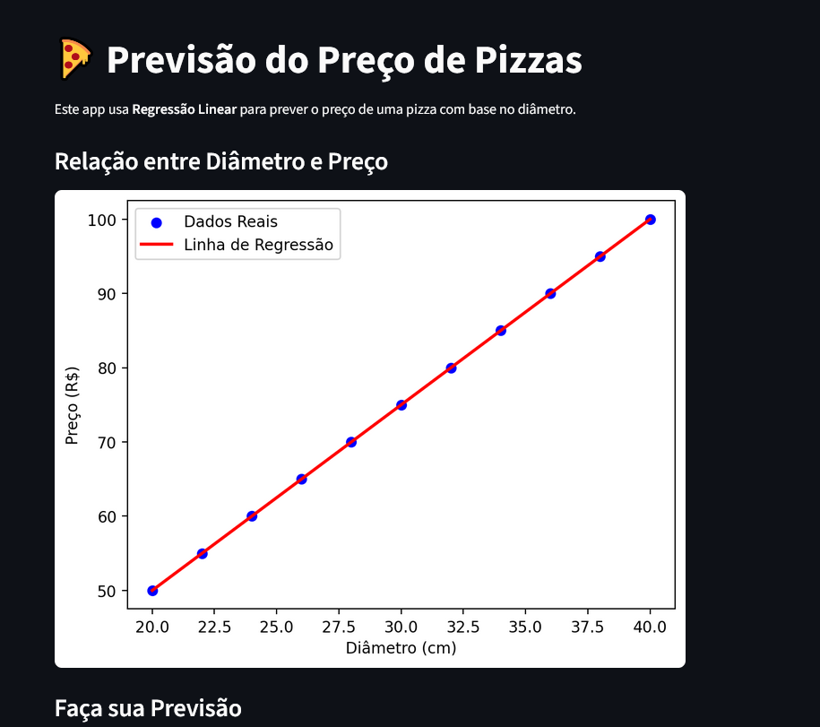

# 🍕 Previsor de Preços de Pizza


---

## 📌 Visão geral

**Previsor de Preços de Pizza** é um projeto de Data Science e Machine Learning que demonstra, de forma prática e visual, como treinar um modelo de Regressão Linear para prever o preço de uma pizza a partir do seu diâmetro. A aplicação web foi construída com **Streamlit** e serve como um excelente projeto para portfólio (focado no mercado de tecnologia de São Paulo — 2025).





## 🛠️ Tecnologias utilizadas

* **Python 3.9+ (compatível com 3.13)**
* **Streamlit** — app web interativo
* **Pandas** — manipulação de dados
* **Scikit-learn** — modelagem (Regressão Linear)
* **Matplotlib** — plotagem de gráficos
* **streamlit-lottie** — exibição de animações Lottie
* **Poetry** — gerenciamento de dependências

---


## 🚀 Como executar o projeto (local)

### Pré-requisitos

* Python 3.9+ instalado
* Poetry instalado (opcional, mas recomendado)

### Passo a passo

```bash
# clonar o repositório
git clone https://github.com/seu-usuario/nome-do-repositorio.git
cd nome-do-repositorio

# criar ativar ambiente (opcional se usar Poetry)
python -m venv .venv
# Windows (PowerShell)
.venv\Scripts\Activate.ps1
# Linux / Mac
source .venv/bin/activate

# instalar dependências com Poetry
poetry install

# ou, se não usar Poetry, instalar manualmente
pip install -r requirements.txt

# rodar a aplicação Streamlit
streamlit run app.py
```

Acesse: `http://localhost:8501`

---

## 📂 Estrutura do projeto

```
projeto01/
├── .venv/               # Ambiente virtual (local)
├── app.py               # Aplicação Streamlit principal
├── pizzas.csv           # Dataset: colunas esperadas: diametro, preco
├── pyproject.toml       # Configuração do Poetry
├── poetry.lock          # Lockfile do Poetry
├── README.md            # Documentação (este arquivo)
├── imagens/             # Coloque screenshots e GIFs aqui
└── tests/               # Testes automatizados
```

**Formato esperado do `pizzas.csv`**

```
diametro,preco
20,30
25,35
30,40
```

---

## ✅ Testes

Para rodar os testes (se houver):

```bash
pytest tests/
```

---

## 💡 Sugestões de melhorias (Roadmap)

* Implementar validação e tratamento de outliers no dataset.
* Adicionar mais modelos (Ridge, Lasso) e seleção automática por cross-validation.
* Endpoint API para previsões via REST (FastAPI).
* Deploy contínuo (Heroku / Render / Vercel para frontend) e CI com GitHub Actions.
* Página de resultados com exportação CSV / PDF.


## 🤝 Contribuição

Contribuições são bem-vindas! Abra uma *issue* ou envie um *pull request*. Por favor, siga o padrão abaixo:

1. Fork o repositório
2. Crie uma branch: `feature/nome-da-sua-feature`
3. Faça commit das mudanças e abra um Pull Request

---

## 📄 Licença

Este projeto está licenciado sob a **MIT License**. Veja o arquivo `LICENSE.md` para detalhes.

---


